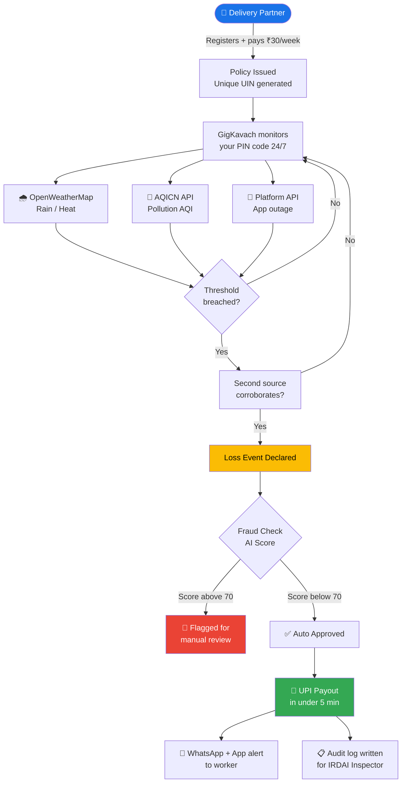
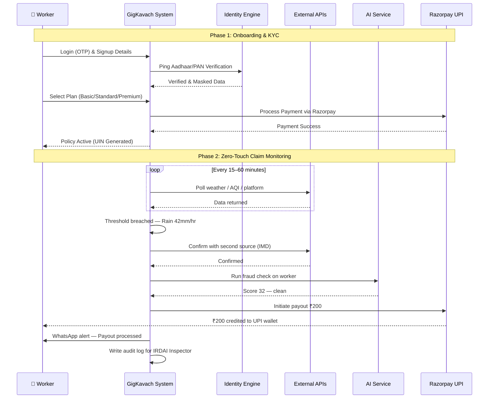
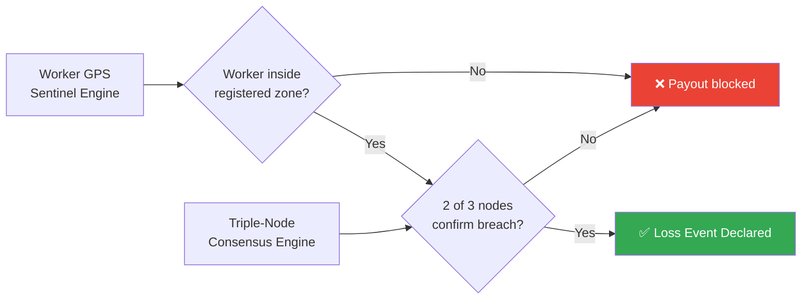
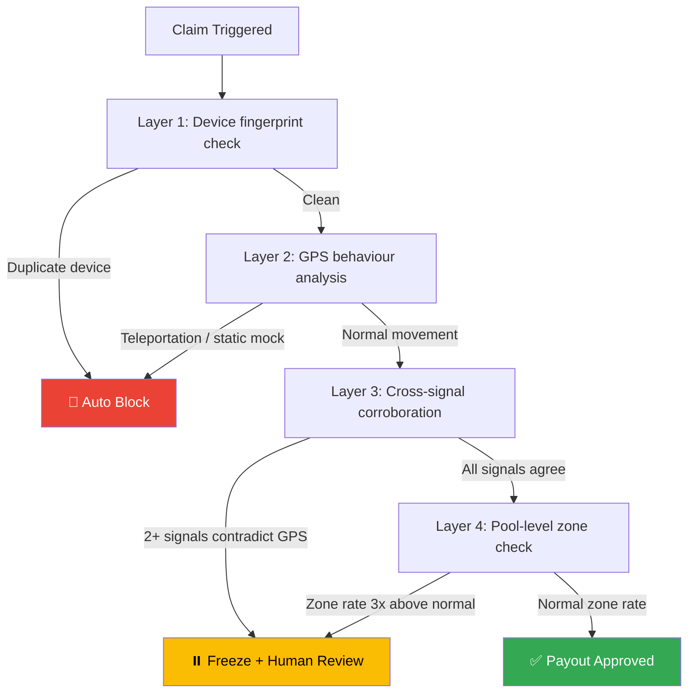
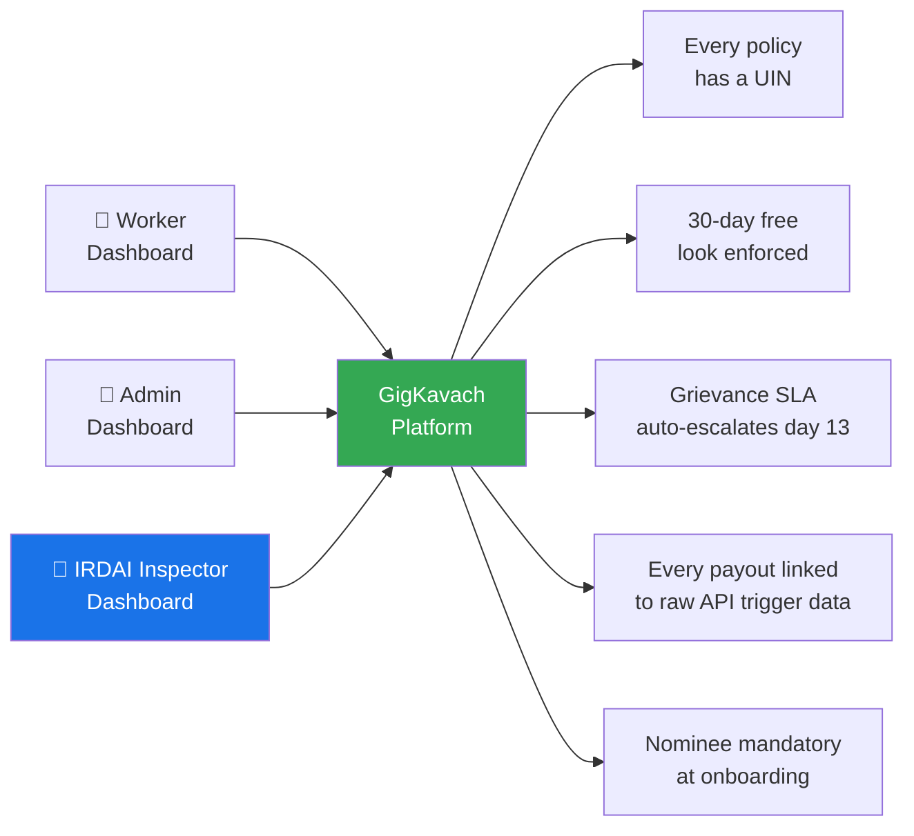

# GigKavach 🛡️
**AI-Powered Parametric Income Protection for India's Food Delivery Partners**
Guidewire DEVTrails 2026 — Phase 3 Submission

**Team:** VisionCoders | BMS College of Engineering

**Pitch Video:** https://youtu.be/j6rNZdCNBcA?si=FwpY-TAH-8BOvIh8
> 🚨 **Market Crash Response included — Section 8: Adversarial Defense & Anti-Spoofing Strategy**

---

## Table of Contents
1. [Persona & Problem](#1-persona--problem)
2. [Platform](#2-platform)
3. [How GigKavach Works — System Overview](#3-how-gigkavach-works--system-overview)
4. [Zero-Touch Claim Workflow](#4-zero-touch-claim-workflow)
5. [Core Scenarios](#5-core-scenarios)
6. [Weekly Premium Model & AI](#6-weekly-premium-model--ai)
7. [Parametric Triggers](#7-parametric-triggers)
8. [Adversarial Defense & Anti-Spoofing Strategy](#-8-adversarial-defense--anti-spoofing-strategy)
9. [IRDAI Compliance](#9-irdai-compliance)
10. [Tech Stack](#10-tech-stack)
11. [Local Setup & Installation](#11-local-setup--installation)
12. [Development Plan](#12-development-plan)
13. [Team](#13-team)

---
## 1. Persona & Problem

Food delivery partners (Zomato & Swiggy) earn ₹700–₹1,200/day entirely from active working hours. When heavy rain, extreme heat, severe pollution (AQI > 300), or a Bandh hits — they earn ₹0 with no safety net. No insurance product exists for this.

**We insure lost time and wages only. No vehicles. No health. No accidents.**

---

## 2. Platform

**Mobile Application (ReactNative + Tailwind)**. Delivery partners rely exclusively on their smartphones to operate. A cross-platform React Native app gives us a single codebase for Android and iOS, with access to native device capabilities — secure push notifications, background location validation for fraud detection, and seamless UPI deep-linking for instant payouts.

---

## 3. How GigKavach Works — System Overview



---

## 4. Zero-Touch Claim Workflow



---

## 5. Core Scenarios

**Scenario A — Zero-Touch Payout**
GigKavach polls APIs every 15–60 minutes. When rainfall exceeds 40mm/24hrs or AQI crosses 300 in the worker's PIN code, a Loss Event is declared automatically. GPS zone validated, fraud check run, UPI credited in under 5 minutes. No form. No approval needed.

**Scenario B — Predictive Earnings Nudge**
Every morning the dashboard shows a 7-day risk forecast:
> *"⚠️ Heavy rain expected Thursday. Work extra today — Thursday income is protected under your ₹36 premium."*

This makes GigKavach a daily earning assistant, not just a safety net.

### ❌ Coverage Exclusions
- Vehicle damage or repairs
- Personal health or accidents
- Acts of war or civil unrest
- Government-declared pandemics
- Self-induced inactivity (worker logged out before trigger)
- Events outside registered zone
- First 24 hours of a new policy (cooling-off period)
---

## 6. Weekly Premium Model & AI

GigKavach offers three coverage tiers, priced dynamically every Sunday by our 
Scikit-learn Gradient Boosting model based on zone risk and forecast data.

| Plan | Price | Triggers | Max Payout/Event |
|---|---|---|---|
| Basic Shield | ₹30/week | Rain >40mm, AQI >300 | ₹400 |
| Standard Shield | ₹45/week | Rain >40mm, AQI >300, Heat ≥40°C, Wind >55km/h | ₹600 |
| Premium Shield | ₹70/week | Rain >35mm, AQI >250, Heat ≥38°C, Wind >45km/h | ₹1,000 |

Premium Shield has lower thresholds — it triggers earlier and pays more.
Priority claim processing under 3 minutes. Premium lock guaranteed for 6 weeks.

Dynamic pricing adjusts the base of each tier every Sunday.
Week-over-week changes capped at ±10% to prevent sudden shocks.

### Pool Viability
500 active workers × ₹36 avg premium = ₹18,000/week collected.
Expected claims: ~12 events × ₹250 avg = ₹3,000/week paid out.
Loss ratio: 16.7% — well within the industry safe zone of <60%.
Pool is sustainable at current premium levels.

### Handling Catastrophic (CAT) & Systemic Risk

Weather creates **correlated risk** — when one worker claims, all workers
in the same zone claim simultaneously. GigKavach prevents pool bankruptcy
through three layered mechanisms:

| Mechanism | How it works |
|---|---|
| **Aggregate limit** | Every policy carries a `payout_cap` calculated by the ML model. A 14-day monsoon pays out on Day 1–3; by Day 4 the cap is reached and the pool stops paying — exactly as the worker's policy promised. |
| **Claim velocity limit** | Basic Shield: max 2 weather-event payouts per 7-day rolling window. Standard / Premium: max 3. Consecutive event decay applies: Day 1 = 100%, Day 2 = 50%, Day 3 = 0%. |
| **Stop-loss reinsurance** *(Phase 3)* | GigKavach's micro-risk pools will be backed by a Stop-Loss Treaty with a global reinsurer (Swiss Re / Munich Re model). If total payouts exceed 120% of premiums collected in any 30-day window — as in a 14-day monsoon — the reinsurer covers the excess. Local liquidity pool is never broken. |

**Dynamic seasonal pricing** acts as a fourth buffer: the Gradient Boosting model recognises rising monsoon risk 4–6 weeks ahead and raises base premiums (within the ±10% weekly cap) so the pool enters peak-risk season with a larger cash reserve.

---

## 7. Parametric Triggers

| Event | Threshold | Source |
|---|---|---|
| Heavy Rain | > 40mm / 24hrs | OpenWeatherMap + IMD |
| Extreme Heat | ≥ 40°C + 4.5°C above city normal | OpenWeatherMap + IMD formula |
| Severe Pollution | AQI > 300 | AQICN API |
| Platform Outage | Downtime > 2 hours | Downdetector |
| Flood / Cyclone | Govt alert issued | NDMA / data.gov.in |

### 7.1 Multi-Node Consensus & Zone Mapping

GigKavach does not rely on city-wide averages. Triggers are executed via a
Triple-Node Consensus Engine mapped to specific operational zones.

| Component | How it works |
|---|---|
| **Zone-Map Anchor** | Automated triggers are only valid within defined high-density delivery hubs — Koramangala, HSR Layout, Indiranagar, and surrounding PIN codes. City-wide averages do not fire payouts. |
| **Dual-Verification** | A payout only fires if the worker's GPS telemetry (Sentinel Engine) places them within a zone where at least two independent weather nodes confirm a threshold breach simultaneously. |



> This means a worker standing outside their registered zone during a storm
> receives no payout — and a storm confirmed by only one node fires nothing.
> Both conditions must be true simultaneously.

Every trigger requires **two independent sources** to confirm before a payout fires.

---

## 🚨 8. Adversarial Defense & Anti-Spoofing Strategy
### Market Crash Response — Coordinated GPS Fraud Ring

> *500 delivery partners are faking GPS locations. A coordinated fraud ring is draining the insurance pool. Simple GPS verification is dead. Here is how GigKavach catches the fakers without punishing honest workers.*

### The Problem: Why Simple GPS Fails

A single GPS coordinate check is trivially defeated. Fake apps, VPNs, and mocked location APIs can spoof a worker into any zone in seconds. Our defense operates across **four independent layers** — any one layer failing does not compromise the system.

---

### Layer 1 — Device Fingerprinting at Onboarding

When a worker registers, GigKavach captures a unique device fingerprint:
- Device ID + hardware hash
- SIM card identifier
- React Native's `expo-device` unique ID

**One device = one policy.** If a second account attempts registration from the same device, it is blocked immediately. This defeats the ring's ability to run multiple fake accounts on the same phone.

---

### Layer 2 — GPS Behavioural Analysis (Catching Teleportation)

A real delivery partner moves like a human. A fraud bot does not.

Every 15 minutes while a policy is active, GigKavach logs the worker's GPS coordinates. Before any payout fires, the AI checks the movement history:

```
Speed between two GPS points = Distance / Time elapsed

If speed > 80 km/h in a city zone during peak hours → IMPOSSIBLE
If location jumps from Koramangala to Whitefield in 4 minutes → TELEPORTATION FLAG
If GPS coordinates are perfectly static for 2+ hours → MOCKED LOCATION FLAG
```

Real workers accelerate, decelerate, stop at restaurants, and move in delivery-shaped patterns. Fraud bots produce unnaturally clean, static, or impossible movement traces. Our Isolation Forest model is trained to detect exactly this.

---

### Layer 3 — Cross-Signal Corroboration (The Key Innovation)

This is what separates GigKavach from basic GPS checks.

When a payout is triggered, we do not just check **where the worker says they are**. We check whether **multiple independent signals agree**:

| Signal | What We Check |
|---|---|
| GPS location | Worker inside registered PIN code zone |
| IP address geolocation | IP resolves to same city as claimed zone |
| VPN detection | IP flagged by VPN blocklist → automatic hold |
| Network cell tower | React Native `expo-location` cross-checks GPS with cell tower data |
| Platform activity | Worker's Swiggy/Zomato app shows active orders in that zone |
| Weather data | Claimed disruption actually exists in that PIN code per API |

A genuine worker in Koramangala during a flood will pass all six checks naturally. A fraud bot faking GPS from a different city will fail at least two or three — IP geolocation, cell tower, and platform activity will all contradict the spoofed GPS.

**Rule:** Any claim where 2 or more signals contradict the GPS → auto-hold + fraud queue.

**Sentinel ML Scorer:** The corroboration logic is powered by a Random Forest / XGBoost model (Sentinel Engine). By analyzing the non-linear relationships between velocity, device history, and multi-node weather consensus, Sentinel generates a probabilistic Fraud Score. Claims with a score $> 0.75$ are immediately neutralized, protecting the actuarial pool from rapid depletion.

---

### Layer 4 — Pool-Level Statistical Monitoring

Individual claim checks catch individual fraudsters. Pool monitoring catches **coordinated rings**.

Every hour, GigKavach's admin dashboard computes:

```
Zone Claim Rate = Claims filed in zone / Active policies in zone
```

If a specific PIN code suddenly shows a claim rate 3x above its historical average — especially during a period when neighbouring PIN codes are unaffected — this is a coordinated ring signature, not a genuine weather event.

**Response:**
- All claims from that zone in the past 2 hours are frozen pending review
- Admin is alerted immediately
- Zone is flagged for enhanced verification for the next 48 hours

This catches the fraud ring as a group, not just individual bad actors.

---

### How We Protect Honest Workers

The biggest risk in fraud defense is punishing innocent people. GigKavach's approach minimises this:

- **Freeze, don't deny.** A flagged claim is held for human review, not automatically rejected. An honest worker whose GPS had a glitch gets their payout after a 2-hour review, not a permanent denial.
- **Explainable flags.** Every hold generates a human-readable reason. The admin sees exactly why a claim was flagged — not just a score.
- **Appeal button.** Any worker can dispute a held payout directly in the app. Dispute triggers a 24-hour manual review with raw API data shown to the reviewer.
- **Fraud score decay.** A worker with one suspicious claim does not carry that flag forever. Score resets after 30 clean days.

---

### Anti-Spoofing Architecture Summary



---

## 9. IRDAI Compliance 

> *"Most insurance products are built for two users — the customer and the insurer. GigKavach adds a third: the IRDAI Inspector. Every payout, policy, and grievance is audit-ready from day one."*



| IRDAI Requirement | Our Implementation |
|---|---|
| Digital policy + UIN | Every policy issued with unique ID stored in MongoDB |
| 30-day free look | Auto-enforced — full refund if cancelled within 30 days |
| Nomination mandatory | Hard-blocked at onboarding without nominee |
| CIS before payment | Coverage summary shown before every UPI deduction |
| Grievance SLA (15 days) | Auto-escalation triggered at day 13 |
| Claim settlement | Parametric = payout in under 5 minutes. Rule destroyed. |
| Pre-Insurance KYC (AML guidelines) | Mandatory Aadhaar/PAN masking and verification step required before a worker is permitted to purchase any premium tier. |

**Inspector Dashboard:** A dedicated admin view showing every policy, payout, API trigger, and grievance with full audit trail — built specifically for IRDAI auditors.

---

## 10. Tech Stack

| Layer | Technology |
|---|---|
| Frontend | React Native + Tailwind CSS |
| Backend | Node.js + Express |
| AI Fraud Engine | Python (scikit-learn) via Node.js Child Process |
| Database | MongoDB Atlas |
| Payment Gateway | Razorpay (Test Mode) |
| Weather (Live Demo) | Open-Meteo (No-key fallback for live hackathon demo) |
| Weather (Enterprise) | Weather Union API (Zomato) + IMD via indianapi.in |
| Deploy | Vercel (Admin Dashboard), Render (Backend) |
| Identity & KYC | Express Middleware + Data Masking Utilities |
| Notification Engine | Node.js Asynchronous Event Emitters |

> *Note: Full Aadhaar OCR (Tesseract.js) and Liveness Checks are mapped out for Phase 3 enterprise compliance but bypassed in the current demo for speed.*

Microservices architecture — AI service runs independently so ML models can be updated without touching the main backend.

---

## 11. Local Setup & Installation
 
**Prerequisites:** Node.js v18+, Python 3.9+, Git, MongoDB
 
### Step 1 — Clone the Repository
```bash
git clone https://github.com/Ankita562/gigkavach.git
cd gigkavach
```
 
### Step 2 — Environment Variables
Create `.env` inside `backend/`:
```
MONGO_URI=your_mongodb_connection_string
ZOMATO_KEY=your_weather_union_key
IMD_API_KEY=your_imd_key
DEMO_MODE=true

```
 
### Step 3 — Train the ML Fraud Engine
Our Random Forest model is trained on a dataset of 5,000+ historical claims. To install the dependencies and generate the `fraud_model.pkl` brain, run:

```bash
cd ml
pip install -r requirements.txt
python train_model.py
```
 
### Step 4 — Run Node.js Backend (Port 5000)
Open a new terminal:
```bash
cd backend
npm install
node server.js
```
✅ Expected: `MongoDB Connected` and `Server running on port 5000`
 
### Step 5 — Run Frontend (Port 5173)
Open a third terminal:
```bash
cd frontend
npm install
npm run dev
```
✅ App running at `http://localhost:5173`
 
### Architecture
```
Frontend  (React Native)   :5173
      ↓
Backend   (Node.js)        :5000  ← trigger engine, claims, policies, fraud
      ↓
AI Service (Python Flask)  :5001  ← risk scoring, premium calculation
      ↓
MongoDB Atlas                     ← users, policies, claims, audit logs
```

### Accessing the Inspector Dashboard
Once all three services are running, open `http://localhost:5173/admin` in your browser to access the GigKavach Admin & IRDAI Inspector Dashboard.


> Set `DEMO_MODE=true` in `.env` when live weather station APIs are
> temporarily unavailable. All three services must run simultaneously
> for the full parametric trigger → fraud check → payout pipeline to work.

---

## 12. Development Plan

| Phase | Weeks | Status | Key Deliverables |
|---|---|---|---|
| Seed | 1–2 | ✅ Complete | README, pitch video, architecture |
| Scale | 3–4 | ✅ Complete | React Native app, backend, trigger engine, premium model, Razorpay |
| Soar | 5–6 | ✅ Complete | Fraud model, Inspector dashboard, final demo video |

**Demo Day scenario:** Live rain trigger fires for Bengaluru PIN 560034 → GPS validated → cross-signal corroboration passes → fraud check clean → UPI payout in under 5 minutes → Inspector dashboard shows full audit trail.

---

## 13. Team

| Name | Role |
|---|---|
| Manaswi Asutkar | Team Lead + Product + IRDAI Compliance |
| M Vishrutha | Mobile Frontend — React Native App, Worker Dashboard |
| Arushi Dhar | Backend — Node.js, MongoDB, Cron Jobs |
| Mahima Koul | ML Engineer — Pricing Model, Fraud Detector |
| Ankita Gupta | Integrations + Admin & Inspector Dashboard |

---

*GigKavach — Parametric income protection for Bharat's invisible workforce.*
*Guidewire DEVTrails 2026 — Phase 2 Submission*
