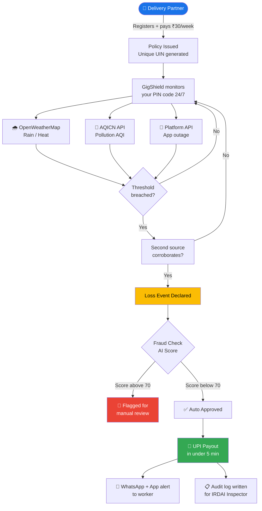
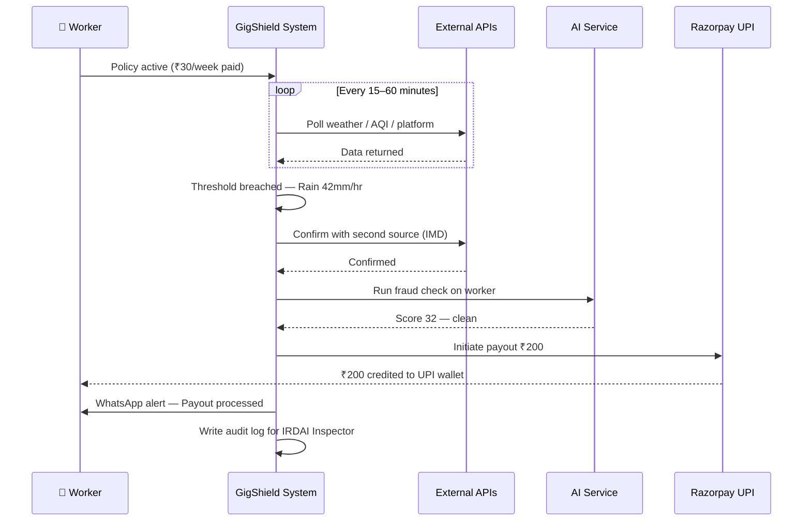
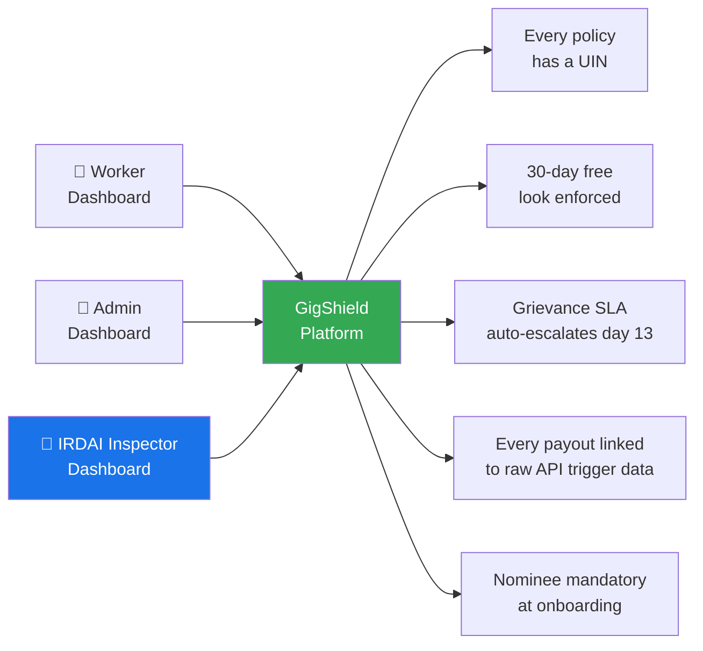

# GigShield 🛡️
**AI-Powered Parametric Income Protection for India's Food Delivery Partners**
Guidewire DEVTrails 2026 — Phase 1 Submission

**Team:** VisionCoders | BMS College of Engineering |
**Pitch Video:** [Link]

---

## 1. Persona & Problem

Food delivery partners (Zomato, Swiggy, Zepto, Blinkit) earn ₹700–₹1,200/day entirely from active working hours. When heavy rain, extreme heat, severe pollution (AQI > 300), or a Bandh hits — they earn ₹0 with no safety net. No insurance product exists for this.

**We insure lost time and wages only. No vehicles. No health. No accidents.**

---

## 2. Platform

**Responsive PWA** (React + Tailwind). Delivery partners already run 4+ heavy apps on budget phones. A browser shortcut requires zero download, works offline, and runs lighter than any native app.

---

## 3. How GigShield Works — System Overview



---

## 4. Zero-Touch Claim Workflow



---

## 5. Core Scenarios

**Scenario A — Zero-Touch Payout**
GigShield polls APIs every 15–60 minutes. When rainfall exceeds 40mm/24hrs or AQI crosses 300 in the worker's PIN code, a Loss Event is declared automatically. GPS zone validated, fraud check run, UPI credited in under 5 minutes. No form. No approval needed.

**Scenario B — Predictive Earnings Nudge**
Every morning the dashboard shows a 7-day risk forecast:
> *"⚠️ Heavy rain expected Thursday. Work extra today — Thursday income is protected under your ₹36 premium."*

This makes GigShield a daily earning assistant, not just a safety net.

---

## 6. Weekly Premium Model & AI

Premium is calculated every **Sunday 11PM** by a Python Scikit-learn Gradient Boosting model.

```
Weekly Premium = ₹30 (base) × Risk Score
Range: ₹20 (low risk) → ₹50 (high risk)
```

**Inputs:** 7-day rainfall forecast, max temperature, AQI forecast, upcoming holidays, zone disruption history, worker claim history.

**Safeguards:** Week-over-week increase capped at +10%, decrease capped at -5%. Full breakdown shown to worker before payment — IRDAI transparency requirement.

**Fraud Detection (Scikit-learn Isolation Forest):**
Real-time anomaly scoring on every claim. Checks GPS zone match, VPN/IP spoofing, GPS consistency, and claim frequency. Score > 70 → manual review. Score > 90 → auto-hold. Every flag generates a human-readable reason for IRDAI auditability.

---

## 7. Parametric Triggers

| Event | Threshold | Source |
|---|---|---|
| Heavy Rain | > 40mm / 24hrs | OpenWeatherMap + IMD |
| Extreme Heat | ≥ 40°C + 4.5°C above city normal | OpenWeatherMap + IMD formula |
| Severe Pollution | AQI > 300 | AQICN API |
| Platform Outage | Downtime > 2 hours | Downdetector |
| Flood / Cyclone | Govt alert issued | NDMA / data.gov.in |

Every trigger requires **two independent sources** to confirm before a payout fires.

---

## 8. IRDAI Compliance — Our Key Differentiator

> *"Most insurance products are built for two users — the customer and the insurer. GigShield adds a third: the IRDAI Inspector. Every payout, policy, and grievance is audit-ready from day one."*



| IRDAI Requirement | Our Implementation |
|---|---|
| Digital policy + UIN | Every policy issued with unique ID stored in MongoDB |
| 30-day free look | Auto-enforced — full refund if cancelled within 30 days |
| Nomination mandatory | Hard-blocked at onboarding without nominee |
| CIS before payment | Coverage summary shown before every UPI deduction |
| Grievance SLA (15 days) | Auto-escalation triggered at day 13 |
| Claim settlement | Parametric = payout in under 5 minutes. Rule destroyed. |

**Inspector Dashboard:** A dedicated admin view showing every policy, payout, API trigger, and grievance with full audit trail — built specifically for IRDAI auditors. 

---

## 9. Tech Stack

| Layer | Technology |
|---|---|
| Frontend | React.js + Tailwind CSS (PWA) |
| Backend | Node.js + Express |
| AI Service | Python + Flask + Scikit-learn |
| Database | MongoDB |
| APIs | OpenWeatherMap, AQICN, Nager.Date, Razorpay Test Mode |
| KYC | Tesseract.js (OCR) + Liveness Check |
| Deploy | Vercel (frontend), Render (backend) |

Microservices architecture — AI service runs independently so ML models can be updated without touching the main backend.

---

## 10. Development Plan

| Phase | Weeks | Deliverables |
|---|---|---|
| Seed | 1–2 | Schema, API setup, wireframes, README, pitch video |
| Scale | 3–4 | PWA frontend, Express backend, MongoDB, trigger engine, premium cron, Razorpay |
| Soar | 5–6 | Fraud model, Inspector dashboard, nudge engine, WhatsApp alerts, 5-min demo video |

**Demo Day scenario:** Live rain trigger fires for Bengaluru PIN 560034 → GPS validated → fraud check passes → UPI payout in under 5 minutes → Inspector dashboard shows full audit trail.

---

## 11. Team

| Name | Role |
|---|---|
| Manaswi Asutkar | Team Lead + Product + IRDAI Compliance |
| M Vishrutha | Frontend — React PWA, Worker Dashboard |
| Arushi Dhar | Backend — Node.js, MongoDB, Cron Jobs |
| Mahima Koul | ML Engineer — Pricing Model, Fraud Detector |
| Ankita Gupta | Integrations + Admin & Inspector Dashboard |

---

*GigShield — Parametric income protection for Bharat's invisible workforce.*
*Deadline: March 20, End of Day*